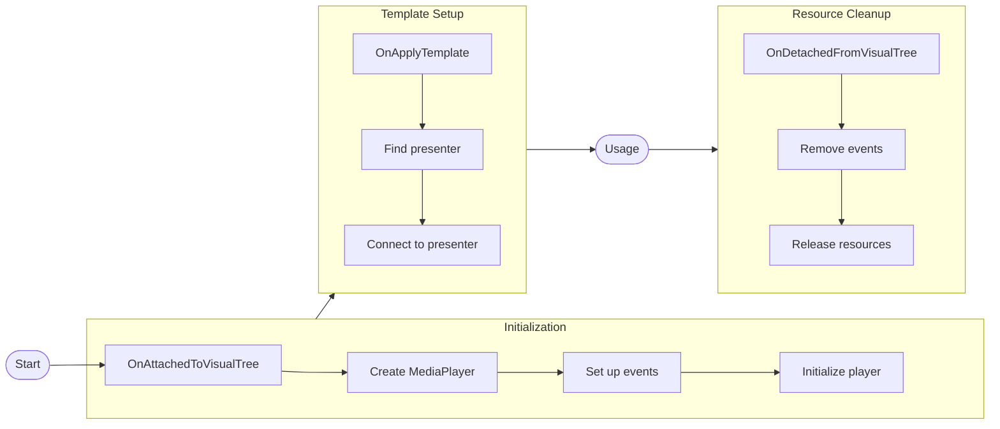
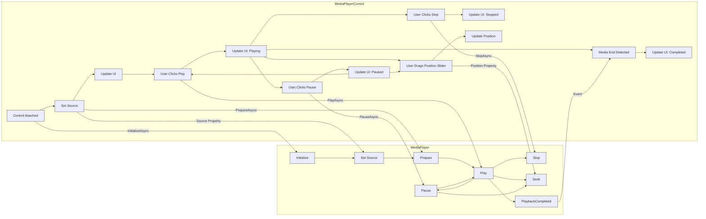

`MediaPlayerControl` 是一个功能齐备的媒体播放界面控件，提供播放控制、进度显示、音量调节和视频渲染。它内部封装了一个 `MediaPlayer` 实例，并为媒体播放配上了完善的用户界面。


:::info
该控件需要 [Avalonia Pro](https://avaloniaui.net/pricing) 或更高版本。
:::

## 快速上手 {#getting-started}

1. 运行 `dotnet add package` 安装 `Avalonia.Controls.MediaPlayer` NuGet 包。

```bash
dotnet add package Avalonia.Controls.MediaPlayer
```

2. 在可执行项目文件（`.csproj`）中填入你的 Avalonia 许可证密钥。密钥可以在 [Avalonia 门户](https://portal.avaloniaui.net)中获取。

```xml
<ItemGroup>
  <AvaloniaUILicenseKey Include="YOUR_LICENSE_KEY" />
</ItemGroup>
```

:::tip
对于多项目解决方案，可以把许可证密钥放进[环境变量](https://learn.microsoft.com/en-us/visualstudio/msbuild/how-to-use-environment-variables-in-a-build)或[共享 props 文件](https://learn.microsoft.com/en-us/visualstudio/msbuild/customize-by-directory?view=vs-2022#directorybuildprops-example)，免得到处重复。
:::

3. 在 `App.axaml` 文件的 `Application.Styles` 中引用默认的 `MediaFluentTheme`，这会引入媒体播放控件所需的资源。

```xml
<Application.Styles>
    <!-- Add this declaration for the default theme. -->
    <MediaFluentTheme/>
</Application.Styles>
```

关于安装 Avalonia Pro 控件的更多内容，请参阅[安装 Avalonia Pro](/tools/installing-avalonia-pro)。

## 用法示例 {#usage-examples}

### 基本用法 {#basic-usage}

默认的 `MediaPlayerControl` 自带一套完整界面。若需更进阶的用法和更深度的定制，你也可以[抛开 `MediaPlayerControl` 直接使用 `MediaPlayer` 类](/controls/media/mediaplayer/mediaplayer-class#using-mediaplayer-without-mediaplayercontrol)。

```xml
<MediaPlayerControl Name="mediaPlayerControl"
                    Source="{Binding MediaSource}"
                    Volume="0.8"
                    LoadedBehavior="AutoPlay" />
```

### 在代码隐藏中设置 Source {#setting-source-in-code-behind}

如果不走绑定、而是在代码隐藏中设置 `Source`，必须等控件加载完成之后再设。在构造函数里设置源会悄无声息地失败，因为此时底层播放后端还没初始化。

```csharp
// Do NOT set Source in the constructor:
// public MainWindow()
// {
//     InitializeComponent();
//     mediaPlayerControl.Source = new UriSource("file:///C:/video.mp4"); // Too early!
// }

// Instead, use OnLoaded:
protected override void OnLoaded(RoutedEventArgs e)
{
    base.OnLoaded(e);
    mediaPlayerControl.Source = new UriSource("file:///C:/Videos/sample.mp4");
}
```

详见[初始化时机](/controls/media/mediaplayer/media-playback#initialization-timing)。

### 绑定到命令 {#binding-to-commands}

```xml
<Button Command="{Binding #mediaPlayerControl.PlayPauseCommand}" 
        Content="Play/Pause" />
        
<Button Command="{Binding #mediaPlayerControl.StopCommand}" 
        Content="Stop" />
```

### 错误处理 {#error-handling}

```csharp
mediaPlayerControl.ErrorOccurred += (sender, args) =>
{
    Console.WriteLine($"Media error: {args.Message}");
    args.Handled = true; // Prevents the exception from being thrown.
};
```

**注意**：这个回调给了你机会，让 `MediaPlayerControl` 的状态得以体面地复位。

## 属性 {#properties}

### 基本属性 {#basic-properties}

| 属性       | 类型             | 说明                                                                                 |
|----------------|------------------|---------------------------------------------------------------------------------------------|
| Player         | MediaPlayer      | 获取底层的 MediaPlayer 实例，实际的媒体播放操作由它完成。 |
| Source         | MediaSource      | 获取或设置要播放的媒体源（`UriSource` 或 `StreamSource`）。                 |
| LoadedBehavior | MediaPlayerState | 获取或设置媒体加载完成后的行为（`AutoPlay` 或 `Manual`）。                    |

### 播放相关属性 {#playback-properties}

| 属性                     | 类型      | 说明                                                                  |
|------------------------------|-----------|------------------------------------------------------------------------------|
| Position                     | TimeSpan  | 获取或设置当前播放位置。                                  |
| Duration                     | TimeSpan? | 获取当前媒体的总时长。不可跳转的媒体返回 null。   |
| SkipTime                     | TimeSpan  | 获取或设置快进/快退命令每次跳过的时长（默认 10 秒）。 |

### 状态属性 {#state-properties}

| 属性                | 类型    | 说明                                                        |
|-------------------------|---------|--------------------------------------------------------------------|
| IsBuffering             | bool    | 获取媒体当前是否正在缓冲。                     |
| BufferProgress          | double? | 获取缓冲进度（0.0-1.0）。无法获取时返回 null。         |
| IsPaused                | bool    | 获取媒体播放当前是否已暂停。               |
| IsMediaActive           | bool    | 获取媒体当前是否处于活动状态（已加载和/或正在播放）。    |
| HasVideo                | bool    | 获取当前媒体是否包含视频内容。             |
| IsSeekable              | bool    | 获取当前媒体是否支持跳转。                      |
| IsOverlayTimeoutEnabled | bool    | 获取或设置一段时间无操作后是否隐藏控制浮层。 |

### 音频属性 {#audio-properties}

| 属性 | 类型   | 说明                                                              |
|----------|--------|--------------------------------------------------------------------------|
| Volume   | double | 获取或设置播放音量，取值已归一化（如 0.0-1.0）。 |
| IsMuted  | bool   | 获取当前是否已静音。                                   |

### 命令属性 {#command-properties}

| 属性            | 类型     | 说明                                                           |
|---------------------|----------|-----------------------------------------------------------------------|
| PlayPauseCommand    | ICommand | 获取在播放与暂停之间切换的命令。          |
| StopCommand         | ICommand | 获取停止播放的命令。                                 |
| MuteCommand         | ICommand | 获取切换静音的命令。                           |
| SkipForwardCommand  | ICommand | 获取按 [SkipTime](#playback-properties) 时长快进的命令。  |
| SkipBackwardCommand | ICommand | 获取按 [SkipTime](#playback-properties) 时长快退的命令。 |

## 事件 {#events}

| 事件           | 说明                                                  |
|-----------------|--------------------------------------------------------------|
| ErrorOccurred | 媒体操作过程中发生错误时引发。 |

## 模板部件与定制 {#template-parts-and-customization}

`MediaPlayerControl` 的默认控件模板包含以下几个关键部件：

- **PART_MediaPlayerPresenter**：显示视频内容
- **MediaControlOverlay**：承载播放控制组件
- **MediaHoverOverlay**：承载悬停状态下的界面元素

`MediaPlayerControl` 最简单的配置大致是这样：

```xml
<!-- In a ResourceDictionary referenced by your app. -->
<ControlTheme x:Key="{x:Type MediaPlayerControl}" TargetType="MediaPlayerControl">
  <Setter Property="Template">
    <ControlTemplate>
      <!-- This border is for decoration and for setting a default background for the control 
         When there's no media. -->
      <Border Background="Gray" ClipToBounds="True" CornerRadius="4">
        <Panel>
          <!-- This is used to have a dark background against the MediaPlayerPresenter when there's a 
                 video to be displayed. -->
          <Border IsVisible="{TemplateBinding HasVideo}">
            <Border Background="Black" IsVisible="{TemplateBinding IsMediaActive}"/>
          </Border>

          <!-- This ViewBox is responsible on how the MediaPlayerPresenter is stretched to fit
                 the bounding area of the control. -->
          <Viewbox>
            <!-- The control in which the internal MediaPlayer draws the video -->
            <MediaPlayerPresenter Name="PART_MediaPlayerPresenter"/>
          </Viewbox>

          <!-- Example of the overlay playback controls. 
                 Use the built-in Commands to easily control the playback. -->
          <DockPanel LastChildFill="True" MaxHeight="64" VerticalAlignment="Bottom">
            <ProgressBar DockPanel.Dock="Bottom"
                         IsIndeterminate="True"
                         IsVisible="{TemplateBinding IsBuffering}"/>
            <StackPanel Orientation="Horizontal"
                        HorizontalAlignment="Center"
                        Spacing="10"
                        Margin="5"
                        TextElement.FontSize="24">
              <Button Content="&#x23EF;"
                      Padding="5,-5,5,0"
                      Command="{TemplateBinding PlayPauseCommand}"/>
              <Button Content="&#x23F9;"
                      Padding="5,-5,5,0"
                      Command="{TemplateBinding StopCommand}"/>
            </StackPanel>
          </DockPanel>
        </Panel>
      </Border>
    </ControlTemplate>
  </Setter>
</ControlTheme>
```

你可以以此和默认主题为起点，把 `MediaPlayerControl` 调成你想要的样子

## 生命周期管理 {#lifecycle-management}

`MediaPlayerControl` 会自动管理其内部 `MediaPlayer` 的生命周期：



下图更完整地描绘了 `MediaPlayerControl` 在整个生存期内与内部 `MediaPlayer` 的交互过程：



## 实践建议 {#best-practices}

1. **Error Handling**:
    - 请始终订阅 `ErrorOccurred` 事件，以便体面地处理错误。
    - 如果你已经处理了错误，请在 `ErrorOccurred` 事件处理程序中把 `Handled` 属性设为 true。

2. **Resource Management**:
    - 控件会自动管理 `MediaPlayerControl` 的生命周期。

3. **UI Integration**:
    - 要和自定义按钮或控件对接时，请使用内置命令。
    - `IsMediaActive` 属性很适合用来启用或禁用界面元素。

## 另请参阅 {#see-also}

- [MediaPlayer 类](/controls/media/mediaplayer/mediaplayer-class)
- [MediaSource 类](/controls/media/mediaplayer/mediasource)
- [Implementing MediaPlayer](/controls/media/mediaplayer/media-playback)
- [Installing Avalonia Pro](/tools/installing-avalonia-pro)
- [疑难排查](/troubleshooting/controls/mediaplayer)