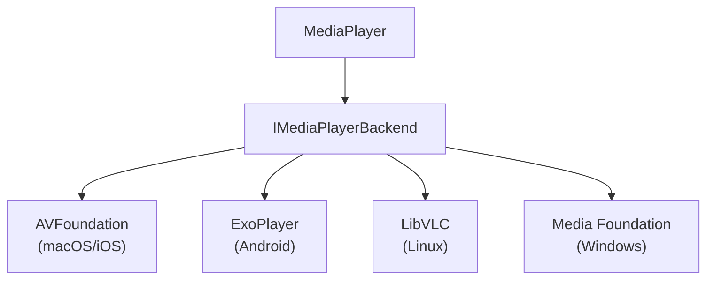

`MediaPlayer` 类为 Avalonia 应用提供媒体播放的核心能力：它负责媒体加载、播放控制和各平台后端的管理，是 [`MediaPlayerControl`](/controls/media/mediaplayer/mediaplayer-class) 背后的引擎。


:::info
该控件需要 [Avalonia Pro](https://avaloniaui.net/pricing) 或更高版本。
:::

## 不用 MediaPlayerControl，直接使用 MediaPlayer {#using-mediaplayer-without-mediaplayercontrol}

不搭配 `MediaPlayerControl` 而单独使用 `MediaPlayer` 时，必须先调用 `InitializeAsync()`，并确保在控件加载完成之后才设置媒体源：

```csharp
private MediaPlayer _player = new MediaPlayer();

protected override async void OnLoaded(RoutedEventArgs e)
{
    base.OnLoaded(e);

    await _player.InitializeAsync();

    _player.Volume = 0.8;
    _player.LoadedBehavior = MediaPlayerState.AutoPlay;

    _player.Source = new UriSource("file:///C:/Videos/sample.mp4");
    await _player.PrepareAsync();
    await _player.PlayAsync();
}
```

## 属性 {#properties}

### 媒体源属性 {#media-source-properties}

| 属性 | 类型        | 说明                                                                 |
|----------|-------------|-----------------------------------------------------------------------------|
| Source   | MediaSource | 获取或设置要播放的媒体源（`UriSource` 或 `StreamSource`）。 |

### 播放相关属性 {#playback-properties}

| 属性       | 类型                      | 说明                                                        |
|----------------|---------------------------|--------------------------------------------------------------------|
| Position       | TimeSpan                  | 获取或设置当前播放位置。                        |
| Duration       | TimeSpan?                 | 获取媒体的总时长。不可跳转的媒体返回 null。 |
| LoadedBehavior | MediaPlayerLoadedBehavior | 获取或设置媒体加载完成后的播放行为。               |

### 状态属性 {#state-properties}

| 属性         | 类型    | 说明                                            |
|------------------|---------|--------------------------------------------------------|
| IsSeekable       | bool    | 获取当前媒体是否支持跳转。       |
| IsBuffering      | bool    | 获取媒体当前是否正在缓冲。         |
| BufferProgress   | double? | 获取缓冲进度（0.0-1.0）。无法获取时返回 null。 |
| HasVideo         | bool    | 获取当前媒体是否包含视频内容。 |
| LastErrorMessage | string  | 在错误状态下，获取最近一条错误信息。     |

### 音频属性 {#audio-properties}

| 属性 | 类型   | 说明                                 |
|----------|--------|---------------------------------------------|
| Volume   | double | 获取或设置播放音量（0.0-1.0）。 |
| IsMuted  | bool   | 获取或设置是否静音。        |

### 进阶属性 {#advanced-properties}

| 属性        | 类型            | 说明                                        |
|-----------------|-----------------|----------------------------------------------------|
| Statistics      | MediaStatistics | 获取播放统计信息（若可用）。 |
| ForceVlcBackend | bool（静态）   | 强制使用 VLC 后端（仅用于调试）。    |

## 事件 {#events}

| 事件                  | 说明                                           |
|------------------------|-------------------------------------------------------|
| NaturalSizeChanged     | 视频的固有尺寸发生变化时引发。    |
| MediaPrepared          | 媒体准备完毕、可以播放时引发。 |
| MediaStarted           | 媒体开始播放时引发。               |
| MediaPaused            | 媒体播放被暂停时引发。           |
| MediaStopped           | 媒体播放被停止时引发。          |
| MediaPlaybackCompleted | 媒体播放结束时引发。             |
| ErrorOccurred        | 发生错误时引发。                  |
| PropertyChanged        | 标准的 INotifyPropertyChanged 事件。                |

## 方法 {#methods}

| 方法            | Return Type | 说明                                   |
|-------------------|-------------|-----------------------------------------------|
| InitializeAsync() | Task        | 初始化媒体播放器及其后端。 |
| PrepareAsync()    | Task        | 为播放准备媒体。              |
| PlayAsync()       | Task        | 开始或继续播放媒体。             |
| PauseAsync()      | Task        | 暂停媒体播放。                        |
| StopAsync()       | Task        | 停止媒体播放。                         |
| ReleaseAsync()    | Task        | 释放当前媒体占用的资源。     |
| UnInitialize()    | Task        | 释放播放器占用的全部资源。    |

## 后端架构 {#backend-architecture}

`MediaPlayer` 采用可插拔的后端架构来支持不同平台：

后端会根据平台自动选择：



## 用法示例 {#usage-examples}

### 基本播放 {#basic-playback}

:::caution
在 Avalonia 界面完全加载之前，`MediaPlayer` 还没准备好接受媒体源。请务必等 `Loaded` 事件触发之后再设置 `Source` 属性，详见[初始化时机](/controls/media/mediaplayer/media-playback#initialization-timing)。
:::

```csharp
private MediaPlayer _player = new MediaPlayer();

protected override async void OnLoaded(RoutedEventArgs e)
{
    base.OnLoaded(e);

    await _player.InitializeAsync();

    _player.Volume = 0.8;
    _player.LoadedBehavior = MediaPlayerLoadedBehavior.Manual;

    _player.Source = new UriSource("file:///C:/Videos/sample.mp4");
    await _player.PrepareAsync();
    await _player.PlayAsync();
}
```

### 使用自定义可视元素 {#using-a-custom-visual}

你可以挂上自定义的可视目标：

```xml
<Window xmlns="https://github.com/avaloniaui"
        Width="800" Height="450">

    <Grid RowDefinitions="*, Auto">
        <Viewbox VerticalAlignment="Stretch" HorizontalAlignment="Stretch">
            <MediaPlayerPresenter Name="presenter" />
        </Viewbox>
    </Grid>

</Window>
```

```csharp
private MediaPlayer _player = new MediaPlayer();

protected async override void OnLoaded(EventArgs e)
{
    base.OnLoaded(e);

    await _player.InitializeAsync();

    _player.UpdateTargetVisual(presenter);
    _player.NaturalSizeChanged += Player_NaturalSizeChanged;
}

private void Player_NaturalSizeChanged(object? sender, NaturalSizeChangedEventArgs e)
{
    UpdatePlayerSize(e.NewSize ?? default);
}

private void UpdatePlayerSize(Size size)
{
    var elemVisual = ElementComposition.GetElementChildVisual(presenter);
    var compositor = elemVisual?.Compositor;

    if (compositor is null || elemVisual is null)
    {
        return;
    }

    elemVisual.Size = new Vector(size.Width, size.Height);
    (presenter as MediaPlayerPresenter)?.SetNaturalSize(size);
    presenter.InvalidateMeasure();
}
```
`MediaPlayerPresenter` 只是图个方便，你完全可以换成任意自定义可视元素；但要记得按 `MediaPlayer` 实例给出的尺寸去更新它。

### 事件处理 {#event-handling}

```csharp
// Setup event handlers
player.MediaPrepared += (s, e) => Console.WriteLine("Ready to play");
player.MediaStarted += (s, e) => Console.WriteLine("Playback started");
player.MediaPlaybackCompleted += (s, e) => Console.WriteLine("Playback completed");

// Error handling
player.ErrorOccurred += (s, e) => {
    Console.WriteLine($"Error: {e.ErrorMessage}");
};
```

### 资源清理 {#resource-cleanup}

```csharp
// Clean up when done
await player.StopAsync();
await player.ReleaseAsync();
await player.UnInitialize();
```

## 错误处理 {#error-handling}

MediaPlayer 采用基于事件的方式处理错误：

- 发生错误时，播放器内部会切换到 Error 状态
- `ErrorOccurred` 事件被引发，并带上详细的错误信息
- 多数方法会检查 Error 状态，发现后便不再继续执行
- 调用 ReleaseAsync() 可复位错误状态

```csharp
// Subscribe to error events
player.ErrorOccurred += (sender, args) =>
{
    // Handle the error appropriately here with your custom logic.
    // Reset with ReleaseAsync() elsewhere if you need to playback again.
    // ...
    Console.WriteLine($"Error: {args.Message}");
};

// Try to play media
try {
    await player.PlayAsync();
}
catch (Exception ex) {
    // Fallback exception handling if needed
    if (player.LastErrorMessage != null) {
        Console.WriteLine($"Error: {player.LastErrorMessage}");
        
        // Optionally reset the player
        await player.ReleaseAsync();
    }
}
```

## 实践建议 {#best-practices}

1. **Initialization Timing**:
    - 切勿在构造函数里设置 `Source`。界面加载完成之前，播放器还没准备好。
    - 请在重写的 `OnLoaded` 中设置 `Source`，或用 `Dispatcher.UIThread.Post` 把调用推迟。
    - 完整说明见[初始化时机](/controls/media/mediaplayer/media-playback#initialization-timing)。

2. **初始化与清理**：
    - 使用 `MediaPlayer` 之前务必先调用 `InitializeAsync()`。
    - 切换不同媒体源之间要调用 `ReleaseAsync()`。
    - 彻底用完 `MediaPlayer` 之后要调用 `UnInitialize()`。

3. **Error Handling**:
    - 订阅 `ErrorOccurred` 事件来处理播放错误。

4. **Resource Management**:
    - 妥善清理，避免资源泄漏。
    - 若要依次播放多个媒体，不妨复用同一个 `MediaPlayer` 实例。

5. **Platform Considerations**:
    - 在所有目标平台上都测试一遍媒体播放。

## 另请参阅 {#see-also}

- [MediaPlayer 控件](/controls/media/mediaplayer)
- [MediaSource 类](/controls/media/mediaplayer/mediasource)
- [Implementing MediaPlayer](/controls/media/mediaplayer/media-playback)
- [Installing Avalonia Pro](/tools/installing-avalonia-pro)
- [疑难排查](/troubleshooting/controls/mediaplayer)